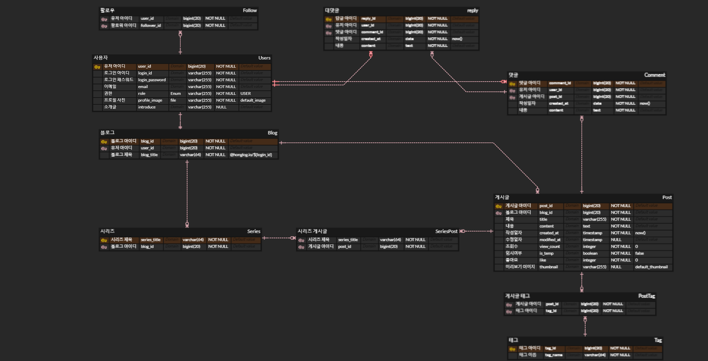

# 🖐HongLog Application

## 📝개요
* **프로젝트명** : HongLog

* **주제** : 블로그 어플리케이션의 기본 - 심화 기능을 연습하는 프로젝트입니다.

* **기간** : 2024년 6월 18일 ~ 2024년 6월 24일

## 🕸 아키텍쳐

- 추가 예정

## ⚒ 기술스택

- 추가 예정

## 💡 주요 기능

- 추가 예정

## 📝 API 명세

- 추가 예정

## 📊 ERD

## 🔨 트러블슈팅

- 추가 예정
- 
## 기능 요구 사항 (개발 중)
⚡️ [벨로그](https://velog.io/)  와 유사한 플랫폼 개발

접기/펼치기
  

### 블로그
 - 회원 1 명은 1 개의 Blog 를 가질 수 있습니다.
 - 회원가입, 로그인 기능을 제공합니다.
 - http://도메인은 사용자들이 작성한 최신 글, 인기 글을 볼 수 있습니다. (정렬방식에 따라 최신, 인기글을 볼 수 있습니다.)
 - http://도메인에서 보여주는 블로그 글에는 제목, 내용일부, 작성자사진, 작성자 아이디, 좋아요 수가 보여집니다.
 - http://도메인/@carami 는 carami 아이디의 사용자의 블로그 페이지입니다.
 - http://도메인/@아이디 를 가면 좌측에 tag 목록이 나오고 tag 에 글의 수가 보여집니다.
 - http://도메인/@아이디 를 가면 글 목록, 시리즈 목록, 소개를 볼 수 있습니다.

### 블로그 포스트
 - 사용자는 임시 글을 작성할 수 있습니다. 
 - 사용자는 글을 작성하자 마자 즉시 출간할 수 있습니다. 
 - 사용자는 임시 글 목록을 볼 수 있습니다. 
 - 글을 작성할 때 이미지, URL 등을 포함시킬 수 있습니다. 
 - 글은 제목, 내용, 태그들을 작성할 수 있고 자동으로 작성일이 지정됩니다. (제목, 내용은 필수 입니다.)
 - 임시 글 목록에서 임시 글을 삭제할 수 있습니다. 
 - 임시 글은 수정할 수 있습니다. 수정 후 바로 출간할 수 있습니다

### 좋아요, 팔로우
 - 사용자는 블로그에서 “좋아하기”를 할 수 있습니다. 
 - 좋아하기를 선택한 블로그 글들만 모아서 볼 수 있습니다. 
 - 사용자가 읽은 글들만 모아서 볼 수 있습니다. 
 - 팔로우 한 사용자 목록을 볼 수 있습니다. 언팔로우 할 수 있습니다.

### 개인정보
 - 사용자는 본인의 프로필 이미지를 등록할 수 있습니다. 
 - 본인이 등록한 프로필을 삭제할 수 있습니다. 
 - 블로그 제목을 설정할 수 있습니다. 설정하지 않으면 기본적으로 사용자 아이디가 됩니다. 
 - 이메일 주소를 변경할 수 있습니다. (회원 가입시 등록할 수 있습니다.)
 - 이메일 수신 설정을 변경할 수 있습니다. (댓글 알림, 업데이트 소식 알림)
 - 회원 탈퇴 기능을 제공합니다.

### 출간
 - 임시 글을 출간하거나, 바로 출간하기를 하게 되면 포스트 미리보기 이미지를 등록할 수 있습니다. 
 - 임시 글을 출간하거나, 바로 출간하기를 하게 될 때 글의 제목과 내용을 일부 보여줍니다. 전체공개로 올릴지 비공개로 올릴지를 결정할 수 있습니다. 
 - 해당 글의 URL 은 /@아이디/posts/제목이 됩니다. 제목은 URLEncoding 으로 인코딩 되어 있어야 합니다. 
 - 임시 글을 출간하거나, 바로 출간하기를 하게 될 때 시리즈에 추가할 수 있습니다.

### 블로그 글보기
 - 블로그 글 보기 기능을 제공합니다. 
 - 비공개 글의 경우 비공개 표시를 제공합니다. 
 - 내 글이 아닌 경우 좋아요를 할 수 있습니다. 
 - 내 글의 경우 통계정보를 볼 수 있습니다. 
 - 내 글의 경우 수정할 수 있습니다. 
 - 내 글의 경우 삭제할 수 있습니다. 
 - 블로그를 작성한 사람의 프로필 이미지와 아이디를 하단에 보여줍니다. 
 - 다른 사람의 글의 경우 팔로우를 할 수 있습니다. 
 - 해당 사용자의 이전 블로그글, 이후 블로그글에 대한 링크를 볼 수 있습니다

### 댓글
 - 블로그에 사용자는 댓글을 작성할 수 있습니다. 
 - 블로그 글보기를 하면 댓글의 수가 표시됩니다. 
 - 댓글에 답글을 작성할 수 있습니다. 
 - 댓글을 삭제할 수 있습니다

### 관리자
 - 관리자 페이지로 가면 모든 포스팅된 글 목록을 볼 수 있습니다.
 - 관리자는 어떤 글이든 삭제할 수 있습니다.

