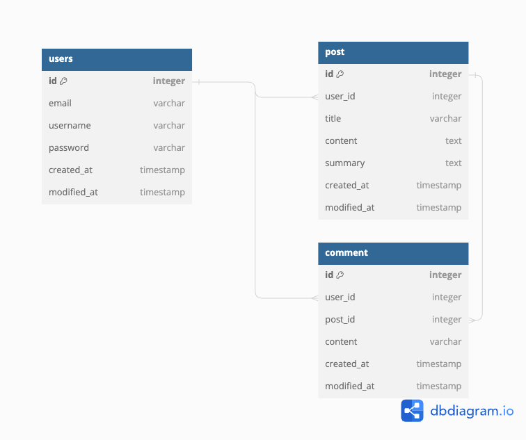

# 블로그 구현 - 첫 번째

- ## 개요
  -  블로그 어플리케이션을 구현하는 첫 번째 단계
- ## 개발 환경
    - #### IDE(IntelliJ IDEA ULTIMATE)
    - #### JDK 17
    - #### Spring Boot 3.2.1
    - #### Gradle 8.5
    - #### H2 Database 2.2.220
## API SPEC

[API specification HTML - Generated via Spring Rest Docs](src/main/resources/static/docs/userdocs.html)

배포 후 추가 예정
### Domain
  - User
    1. 회원 가입 (필수 필드: 이메일, 닉네임, 비밀번호)
       - 이미 등록된 이메일은 회원 가입 할 수 없다.
    2. 회원은 프로필을 상세 조회 할 수 있다.
  - Post
    1. 회원은 포스트를 포스팅을 할 수 있다. (필수 필드: 제목, 내용)
    2. 회원은 포스트를 수정 할 수 있다.
    3. 비회원 &  회원 모두 포스트 목록을 조회 할 수 있다. (페이징 구현 필요, 포스팅은 게시일 내림차순으로 정렬)
    4. 비회원 & 회원 모두 포스트를 상세 조회를 할 수 있다. (작성된 댓글도 모두 조회)
  - Comment
    1. 회원은 포스트에 댓글을 달 수 있다.
    2. 회원은 자신이 작성한 댓글을 수정 할 수 있다.

## ERD

